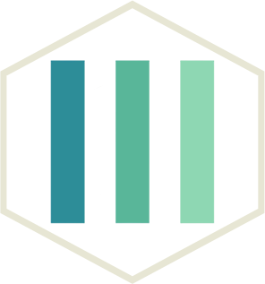

# IoTSmartFarm
IoT Smart Farm with Arduino and Monitoring Website

<!--
*** Thanks for checking out the Best-README-Template. If you have a suggestion
*** that would make this better, please fork the repo and create a pull request
*** or simply open an issue with the tag "enhancement".
*** Thanks again! Now go create something AMAZING! :D
-->


<!-- PROJECT SHIELDS -->
<!--
*** I'm using markdown "reference style" links for readability.
*** Reference links are enclosed in brackets [ ] instead of parentheses ( ).
*** See the bottom of this document for the declaration of the reference variables
*** for contributors-url, forks-url, etc. This is an optional, concise syntax you may use.
*** https://www.markdownguide.org/basic-syntax/#reference-style-links
-->
![Contributors][contributors-shield]
[![MIT License][license-shield]][license-url]
[![LinkedIn][linkedin-shield]][linkedin-url]


<!-- PROJECT LOGO -->
<br />
<p align="center">
    
  </a>

  <h3 align="center">IoT Arduino Smart Farm</h3>

  <p align="center">
    An Raspberry & Arduino based IoT smart Farm 
    
</p>


<!-- TABLE OF CONTENTS -->
<details open="open">
  <summary>Table of Contents</summary>
  <ol>
    <li>
      <a href="#about-the-project">About The Project</a>
      <ul>
        <li><a href="#built-with">Built With</a></li>
      </ul>
    </li>
    <li><a href="#contact">Contact</a></li>
  </ol>
</details>


<!-- ABOUT THE PROJECT -->
## About The Project (In Spanish)

El Internet de las Cosas (Internet of Things), también llamado Internet de todo o
Internet industrial, es un nuevo paradigma tecnológico concebido como una red global de
máquinas y dispositivos capaces de interactuar entre sí. El IoT es reconocido como una de
las áreas más importantes de la tecnología del futuro y está recibiendo la atención de una
amplia gama de industrias debido al potencial que tiene de automatizar procesos y con ello
ser más eficientes, reducir costos y mantenerse competitivos. Sin embargo, la industria no
es el único sector que puede beneficiarse de esta tecnología ya que, como lo ejemplifica el
desarrollo de este proyecto, también es aplicable para ayudar a resolver problemáticas del
crecimiento urbano.

El objetivo del proyecto es el diseño e implementación de un sistema de huerto
urbano que permita mantener dentro de rangos específicos la temperatura, la luminosidad
y la humedad que necesita la planta para crecer y de manera automática. Para el
monitoreo de estas variables se deben almacenar en una base de datos que pueda
accederse desde cualquier parte del mundo utilizando internet.


### Built With

* [Python3](https://www.python.org/)
* [Bootstrap](https://getbootstrap.com)
* [JQuery](https://jquery.com)
* [JSON](https://www.json.org/)
* [PHP 7.4.21](https://www.php.net/)
* [Arduino NodeMCU ESP8266](https://www.arduino.cc/)
* [MQTT Paho](https://pypi.org/project/paho-mqtt/)


### Prerequisites

Prepare the server to run the PHP website

Arduino NodeMCU ESP8266 controllers (As desired)

Install all the instalable software described in "Build With" section, and the MQTT library in python
* MQTT Paho
  ```sh
  pip3 install paho-mqtt
  ```

### Installation

1.- Clone the repository in a folder inside your running server <br>
2.- Connect the Arduino controllers as shown in PDF manual.<br>
3.- Run the mqtt2.py Python handler server<br>


<!-- LICENSE -->
## License

Distributed under the MIT License.

<!-- CONTACT -->
## Contact

Alberto Navarrete- [Linkedin](https://www.linkedin.com/in/albertonr/) - albertonavarreteramirez@gmail.com

For more information about contributors, please send and email.


<!-- MARKDOWN LINKS & IMAGES -->
<!-- https://www.markdownguide.org/basic-syntax/#reference-style-links -->
[contributors-shield]: https://img.shields.io/badge/CONTRIBUTORS-5-GREEN?style=for-the-badge
[license-shield]: https://img.shields.io/badge/LICENSE-MIT-GREEN?style=for-the-badge
[license-url]: https://github.com/othneildrew/Best-README-Template/blob/master/LICENSE.txt
[linkedin-shield]: https://img.shields.io/badge/-LinkedIn-black.svg?style=for-the-badge&logo=linkedin&colorB=555
[linkedin-url]: https://www.linkedin.com/in/albertonr/
[product-screenshot]: images/screenshot.png
